# Game Description

[Minecraft](https://www.minecraft.net/en-us) is a closed-source open-world sandbox game.
It is a widely adopted subject with rich agent baselines due to its popularity and the complexity of its environment for supporting all kinds of realistic agent behaviours.

Minecraft complies through Platforms and is available on Windows, macOS, Linux, Android, and IOS.

Since this game is a closed-source game, we can only run MIMIC through a third-party API library, [Mineflayer](https://prismarinejs.github.io/mineflayer/#/), that can generate a bot inside the game and interact with the game world.

# How to Run MIMIC

## Prerequisites
- This game supports running on Windows, macOS, Linux, Android, and IOS. But the MIMIC agent is only supported on Windows and macOS, and the supportive is only tested on macOS.
- This game has many editions, but MIMIC is only tested on the Java Edition of Minecraft.

## IMPORTANT
- Make sure your working directory is set to the `MIMIC` directory, as all commands and configurations will be based on this path.
- Sadly, to run MIMIC on Minecraft, you **have to buy your own Minecraft account** and install the game on your computer. MIMIC is not able to run on the free version of Minecraft.
- As mentioned in the paper, [ODYSSEY](https://doi.org/10.48550/arXiv.2407.15325) is taken as the state-of-the-art agent baseline. And all the experiments were conducted based on this [version](https://github.com/zju-vipa/Odyssey/tree/19f8c06feb4d431e91ff2f2db89c74ac6a67108f) of ODYSSEY.

## Install the Game
Download and install Minecraft from the [official website](https://www.minecraft.net/en-us/download).

## MineCraft Server Deployment

### Download Server of the Required Version

1. Download the installer for the server [here](https://fabricmc.net/use/installer/) by clicking on the button `Download installer (Universal/.JAR)`. 
2. Open it and select the `Client` tab.
3. Select the `Minecraft Version` to 1.19, and `Loader Version` to 0.14.21. These versions are tested and working with MIMIC.

   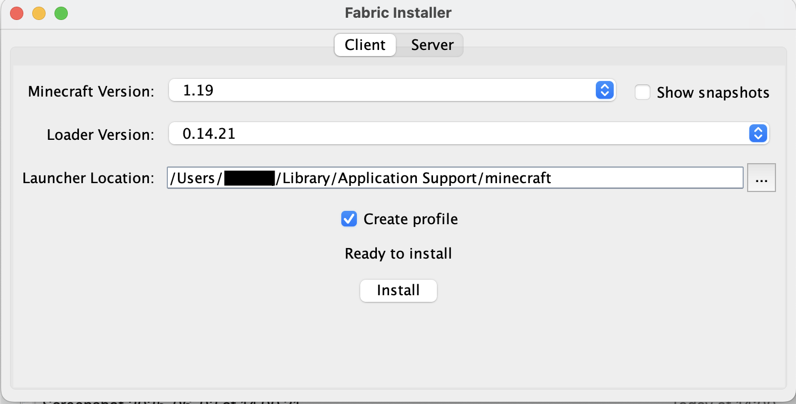

4. Click on the `Install` button to install the Fabric Loader. Make sure none of the Minecraft launchers or games is running when you are installing the Fabric Loader.

### Download Mods

1. To support seamless interaction between MIMIC and Minecraft, the following mods are required and none of them modifies the game mechanics or adds any new features to the game. They are only used to support the interaction between MIMIC and Minecraft.

2. All the tested versions are also provided in the folder `./MIMIC_Minecraft/mods`.

3. [Fabric API](https://modrinth.com/mod/fabric-api/version/0.58.0+1.19): Basic Fabric APIs.

4. [Mod Menu](https://cdn.modrinth.com/data/mOgUt4GM/versions/4.0.4/modmenu-4.0.4.jar): Used to manage all the mods that you download.

5. [Complete Config](https://www.curseforge.com/minecraft/mc-mods/completeconfig/download/3821056): Dependency of server pause.

6. [Multi Server Pause](https://www.curseforge.com/minecraft/mc-mods/multiplayer-server-pause-fabric/download/3822586): Used to pause the server when waiting for GPT-4 to reply.

7. Put them at `/Users/your_username/Library/Application Support/minecraft/mods` on macOS or `C:\Users\your_username\AppData\Roaming\.minecraft\mods` on Windows.
   - If there is no `mods` folder, you can create one there.

### Start the Game
1. Open the Minecraft Launcher and click on the `Installations` tab.
   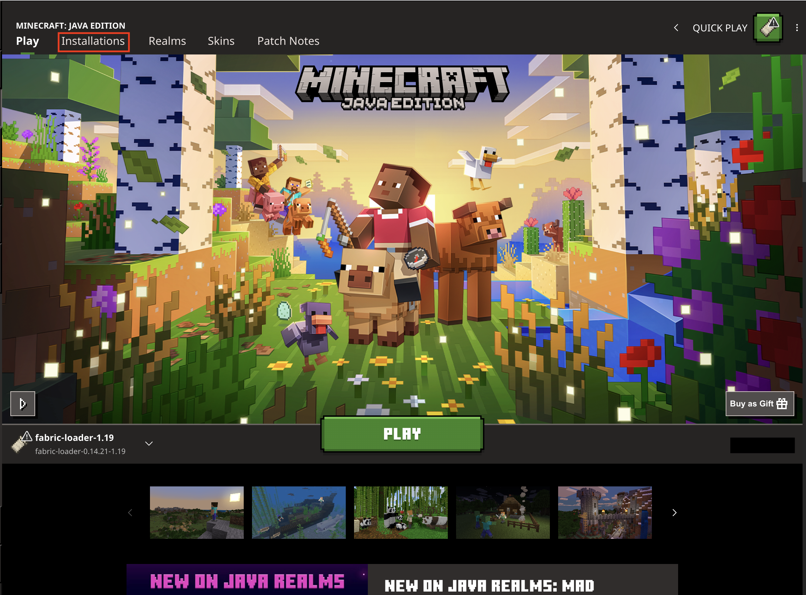

2. Click on the `New Installation` button to create a new installation.

   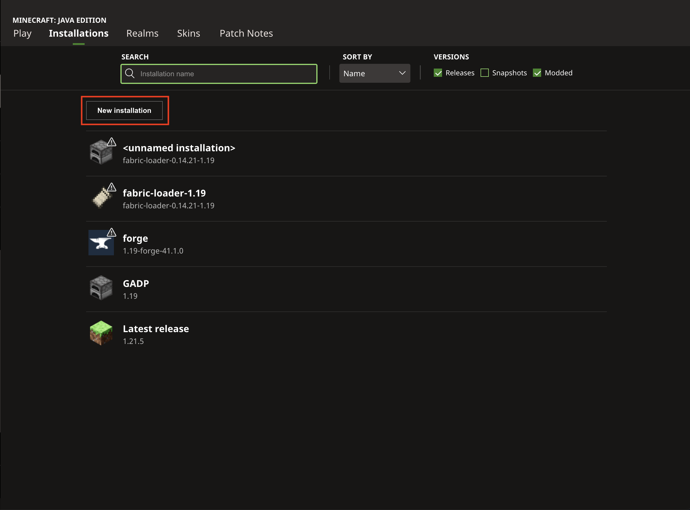

3. Configure the installation as follows, and then click on the `Install button:
   - Name: MIMIC Environment
   - Version: fabric-loader-0.14.21-1.19

   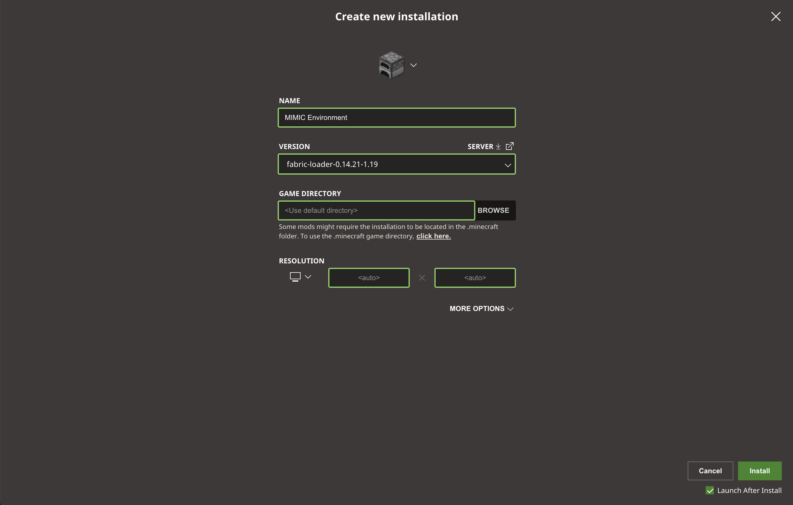

4. After the installation is complete, it would automatically start the Game in this version. 
If no, please go back to the Play tab, and select the `MIMIC Environment` installation you just created, and click on the `Play` button.

   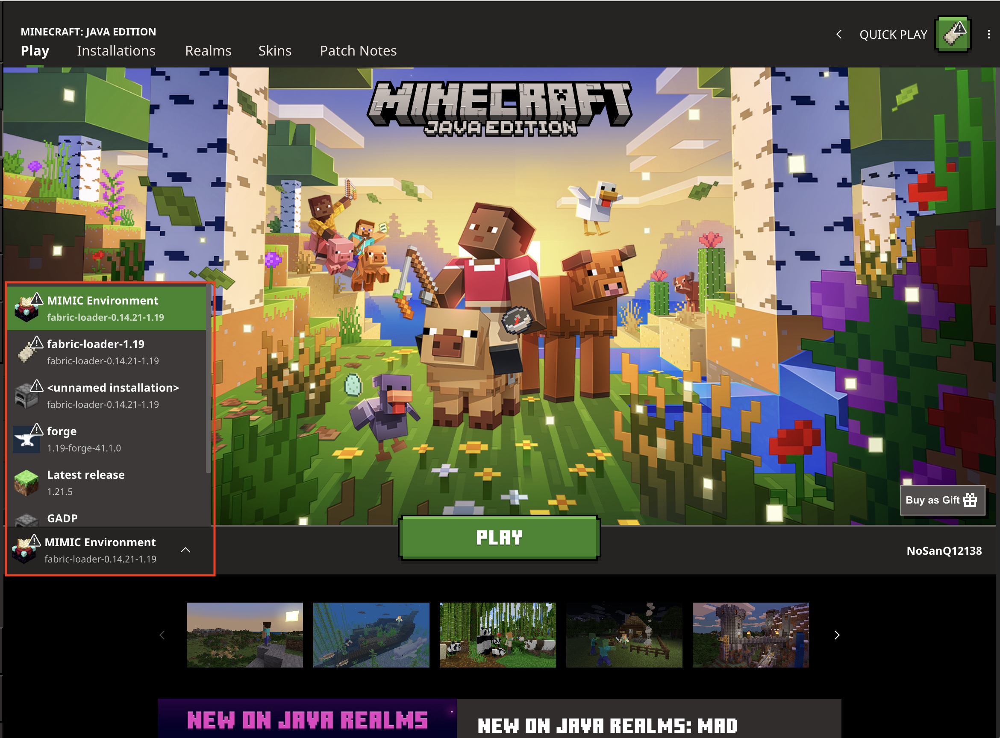

### Start the Server
1. While in the game, click on the `Singleplayer` button, and then click on the `Create New World` button.

2. Configure the world as follows, and then click on the `Create New World` button:
   - Name: MIMIC World
   - Game Mode: Creative
   - Difficulty: Peaceful
   - Allow Cheats: ON
   
   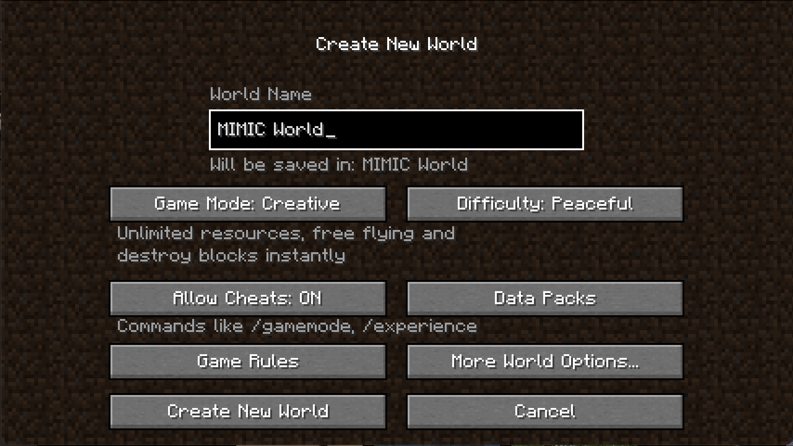

3. Once in the game, check if you have all the mods we need by pressing on the key `Escape` and click on the `Mods` button. You should see the following mods listed:

   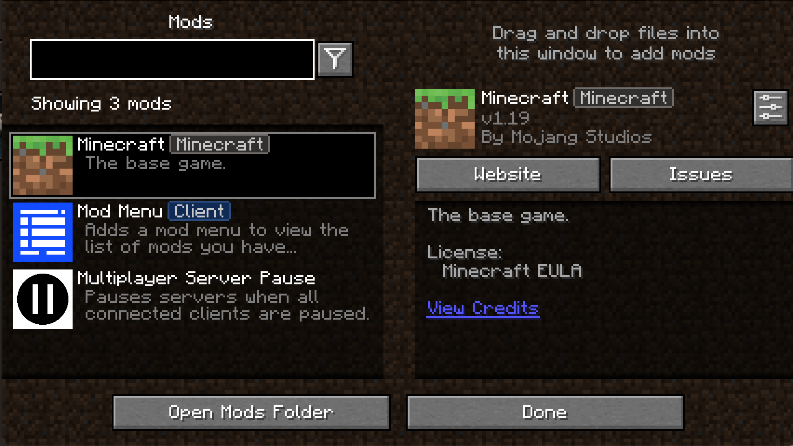

4. Then, get back to the game and press the key `Escape` again, and click on the `Open to LAN` button to open a local server for MIMIC.

   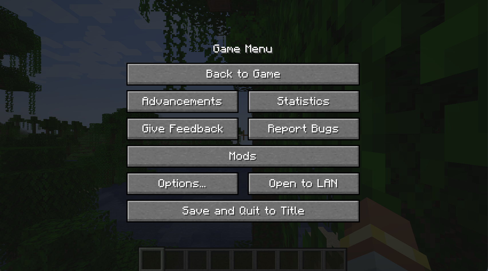

5. Configure the LAN server as follows, and then click on the `Start LAN World` button:
   - Game Mode: Survival
   - Allow Cheats: ON

    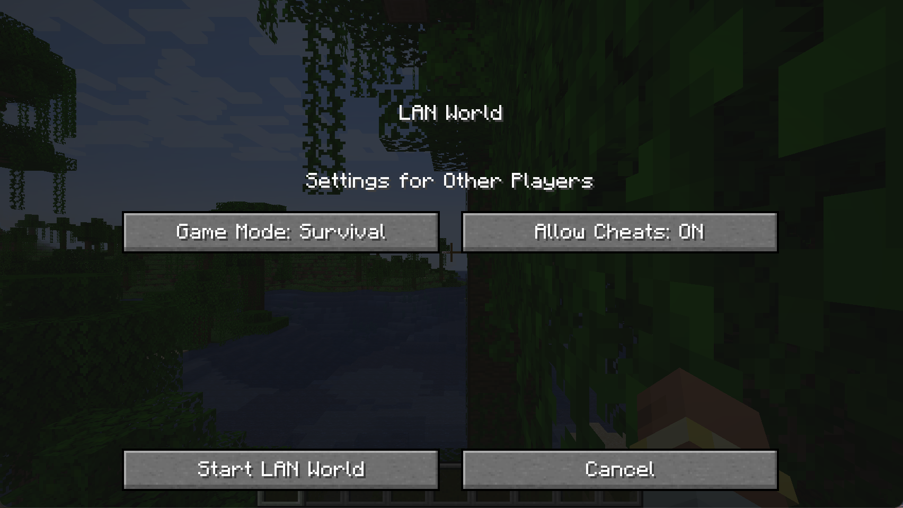

6. Once the LAN server is started, you should see a message in the chat window indicating that the server is running, along with the port number. For example:

   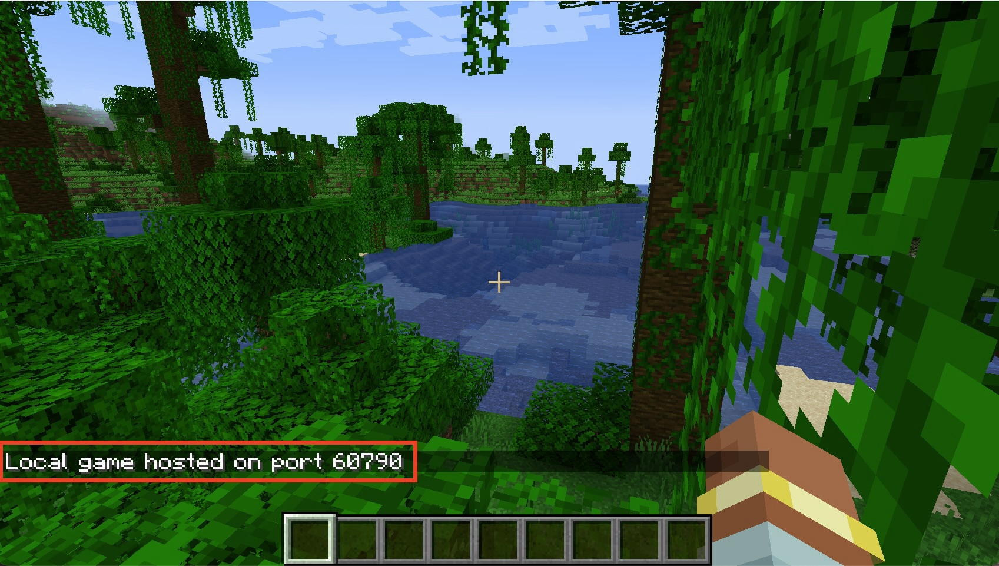

7. Take this port number as the `MC_SERVER_PORT` in the `./MIMIC_Minecraft/config.json` file, which is used to connect MIMIC to the Minecraft server later.
The detailed instruction to set the `config.json` file will be introduced later.

## Navigate to this directory
   ```bash
   cd ./MIMIC_Minecraft
   ```

## Install Node.js and Dependencies
1. Make sure you have [Node.js](https://nodejs.org/) installed on your machine.

3. Open a new terminal and navigate to the `./MIMIC_Minecraft` directory.
    ```bash
    cd ./MIMIC_Minecraft
    ```

4. Install the required dependencies by running the following command:

    ```bash
    npm install chromadb@1.10.5
    npm install
    ```

## Run ChromaDB in Docker

1. Install [Docker Desktop](https://www.docker.com/products/docker-desktop/) on your machine.

2. Launch Docker Desktop and ensure it is running.

3. Pull the ChromaDB Docker image and set the configuration to run it without tenant support:

    ```bash
    docker pull chromadb/chroma:latest
    docker run -p 8000:8000 chromadb/chroma --enable-tenant=False
    ```

4. Run the ChromaDB Docker container with the following command:

    ```bash
    docker run -d -p 8000:8000 --name chromadb chromadb/chroma
    ```

5. Make sure the ChromaDB server is running by checking the logs in Docker Desktop.

## Configure the Settings
1. Taking `config.json.example` file located in the `./MIMIC_Minecraft` directory as an example to create the `config.json` file located in the same place.

2. Set the "OPENAI_API_KEY" to your OpenAI API key, which you can obtain from the [OpenAI website](https://platform.openai.com/settings/organization/api-keys).
   - If you don't have an OpenAI API key, you can sign up for free and get one.
   - Make sure to keep your API key secure and do not share it publicly.
   - This key is required for MIMIC to interact with the OpenAI API and generate responses.
   - This key should look like `sk-XXX...` or `sk-proj-XXX...`

3. Set the "MIMIC_PERSONALITY" to the desired personality of MIMIC. You can choose from the following options:
   - "achievement"
   - "adrenaline"
   - "aggression"
   - "caution"
   - "completion"
   - "curiosity"
   - "efficiency"

4. Set the "TASK" to the desired task for MIMIC to perform. You can choose from the following options:
   - "combat_1_cave_spider"
   - "combat_1_skeleton"
   - "combat_1_spider"
   - "cook_1_meat"
   - "harvest_1_diamond"
   - "harvest_1_sugar"
   - "sheer_1_sheep"
   - "survive_for_1_day"

5. Set the "MONSTER_TYPE" to the one you want to fight against which is aligned to the task you set. You can choose from the following options:
   - "cave_spider"
   - "skeleton"
   - "spider"

6. Set the "MC_SERVER_HOST" to your local host which by default is `127.0.0.1`

7. Set the "MC_SERVER_PORT" to the port number of the Minecraft server you started earlier. 
This is the port number you got when you started the LAN server in Minecraft.
According to the example screenshot, the port number is `60790`.


## Run MIMIC
1. Once you configured all the settings in the `config.json` file, you can start MIMIC by running the following command in the terminal:

    ```bash
    node ./bridge/agentClient.js
    ```

2. After running the command, you should see the following output in the terminal:

    ```
   (node:61965) [DEP0040] DeprecationWarning: The `punycode` module is deprecated. Please use a userland alternative instead.
   (Use `node --trace-deprecation ...` to show where the warning was created)
   (node:61965) Warning: Accessing non-existent property 'bot_msg' of module exports inside circular dependency
   (node:61965) Warning: Accessing non-existent property 'err_msg' of module exports inside circular dependency
   (node:61965) Warning: Accessing non-existent property 'bot_msg' of module exports inside circular dependency
   (node:61965) Warning: Accessing non-existent property 'err_msg' of module exports inside circular dependency
   $$ skill_library.SkillManager:log achievement_skill_collection_Example created successfully.
   memory_stream.MemoryStream:log Writing ./memory_system/Example//achievement/achievement.json...
   memory_stream.MemoryStream:log "./memory_system/Example//achievement/achievement.json" written successfully
   $$ memory_stream.MemoryStream:log achievement_memory_collectionR_Example created successfully.
   $$ memory_stream.MemoryStream:log achievement_memory_collectionP_Example created successfully.
   $$ bridge.mc_bot:log Bot joined the game
   $$ bridge.mc_bot:log Minecraft version: 1.19
   $$ bridge.mc_bot:log Minecraft protocol version: 759
   Mineflayer detected that you are using a deprecated event (physicTick)! Please use this event (physicsTick) instead.
   ```

   - You will also see the following output in the Minecraft chat window:

    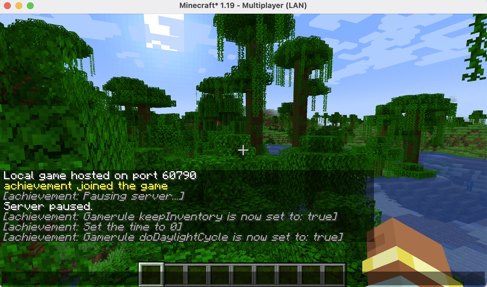

3. Press key `T` to open the in-game chat window, and type the command `b` to start MIMIC.

## IMPORTANT:
1. To make sure MIMIC can run properly, please make sure you have the following mods installed and enabled in the Minecraft game:
   - Fabric API
   - Mod Menu
   - Complete Config
   - Multi Server Pause

2. To make sure MIMIC can run properly, please make sure you do not pause the game by pressing the key `Escape` or put the game in the background while MIMIC is running.

3. To make sure the game does not process while waiting for the response from the LLM, MIMIC would automatically pause the game when it is not processing any action in the game.
   - This is commonly done by all the agents in the fields.
   - However, since there is no external API to know if the game is paused or not, instead of setting it to False or True, it toggle the boolean flag.
   - As a result, make sure the game is running when you start MIMIC (by checking if you can move or not), if not, press key `T` and type the command `/pause` before starting MIMIC.
   
4. Due to game mechanics, the agent won't always respawn next to you, so you may need to teleport it to you, or vice versa.
   - You can do this by typing the command `/tp {YOUR_USERNAME} {MIMIC_PERSONALITY}` in the in-game chat window.
   - This will teleport the bot to your current position.
   - Reverse the order of the parameters to teleport the bot to you (`/tp {MIMIC_PERSONALITY} {YOUR_USERNAME}`).