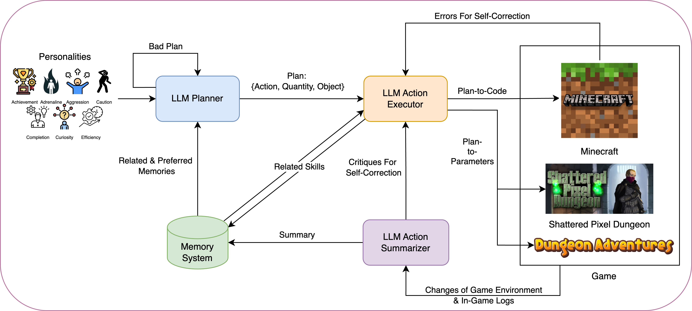
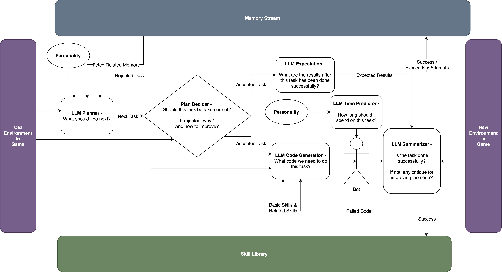
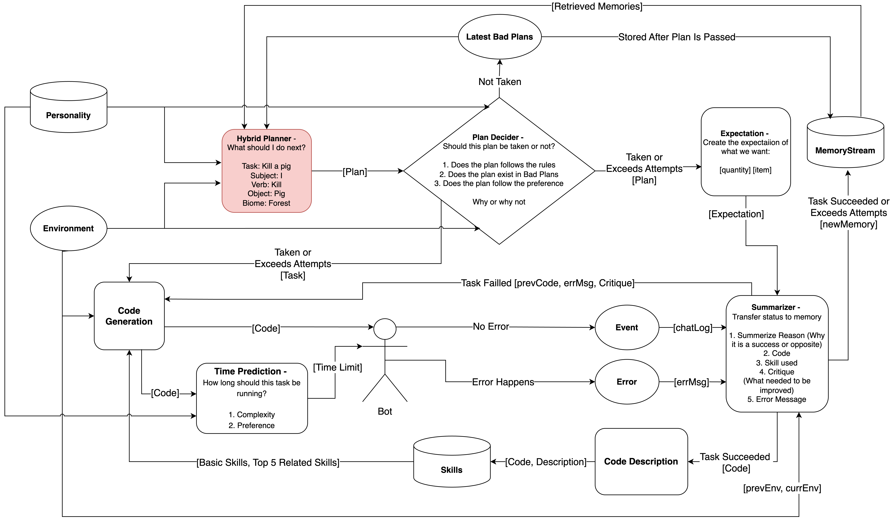
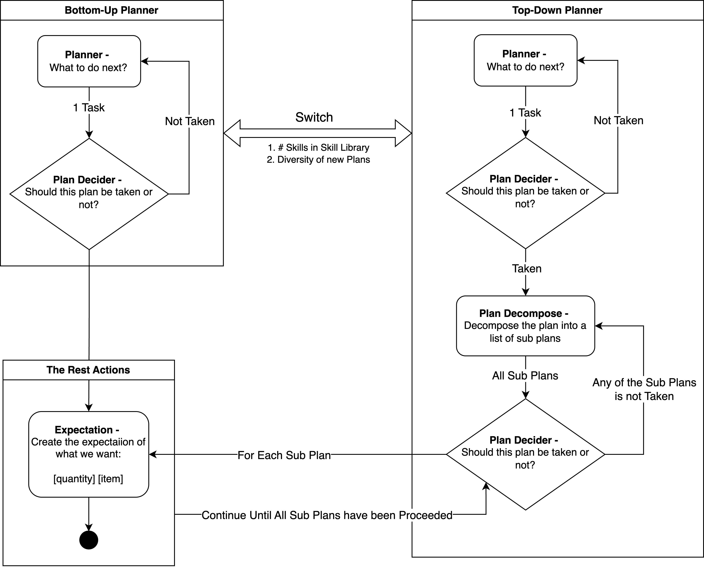

# MIMIC: Integrating Diverse Personality Traits for Better Game Testing Using Large Language Model
This repository is the artifact of MIMIC.

In this repository, you will find the code and instructions to run MIMIC, a Large Language Model (LLM) based, personality-driven agent designed to test three different games, including [Dungeon Adventures](https://github.com/stelmaszczykadrian/Dungeon-Adventures), [Shattered Pixel Dungeon](https://shatteredpixel.com/), and [Minecraft](https://www.minecraft.net/en-us).

# How to Run MIMIC
Please go to the corresponding game directory to find the instructions on how to run MIMIC for that specific game.

# Prompts
Please find all the prompts used in the `context` directory. Each prompt is tailored to the specific game and personality traits of the agent:
- [Dungeon Adventure](./MIMIC_Dungeon_Adventures/src/main/java/com/codecool/dungeoncrawl/agent/context)
- [Shattered Pixel Dungeon](./MIMIC_Shattered_Pixel_Dungeon/core/src/main/java/com/shatteredpixel/shatteredpixeldungeon/agent/context)
- [Minecraft](./MIMIC_Minecraft/context)

# Acknowledgements
MIMIC-Persona: Doing everything for this project.

ChatGPT: As the only artist in this group making the Avatar.

# Overview of MIMIC

# Design of MIMIC

## Abstract Workflow

## Detailed Workflows

## Hybrid Planner Architecture

[//]: # (## Memory System Architecture)

[//]: # (![Memory System Architecture]&#40;./images/MIMIC_Memory_System_Workflow.png&#41;)